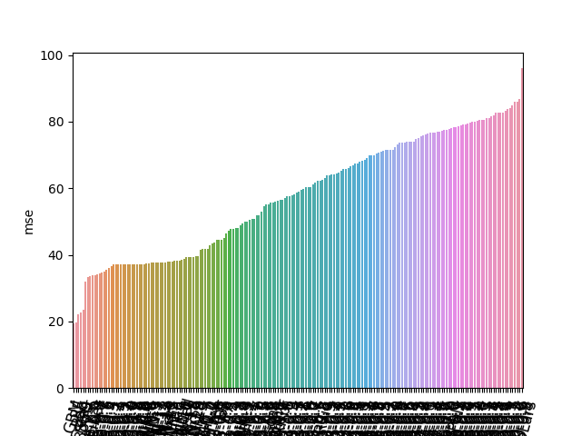

# Spot Check Regression Algorithms

One function that tries several models and outputs the best MSE cross-validation score.

### Steps

- Define the Problem
  - X Define the goal
  - X List the data sources
  - X List the data descriptions
  - X Find missing values
  - X Find infinity values
  - X Identify which column is the target
  - X Identify the non-numeric columns
  - X Skip removing outliers or normalizing
- Prepare Data
  - X Clean missing and infinity values
  - X Drop any category columns
  - X Create X and y
- Spot Check Algorithms
  - X Get baseline MSE  
- Improve Results
  - X Find the CV code to use
  - X Try CV on Linear Regression
  - X Try CV on 9 other regression models
  - X Function: Run all 10 and identify the best model
  - X Function: Change the parameters of that model at least 10 times and identify the best model
  - X Output a plot of the results of all models compared to baseline
- Present Results
  - Write an Confluence document:
    - understandable, basic, in isolation, and plots
  - Compare best model with Kaggle results
  - Save the tool as a module

### Data Sources

housingdata: https://www.kaggle.com/apratim87/housingdata

### Data Description

- Data description was copied from: https://www.kaggle.com/apratim87/housingdata

- CRIM per capita crime rate by town ZN proportion of residential land zoned for lots over 25,000 sq.ft.
- INDUS proportion of non-retail business acres per town
- CHAS Charles River dummy variable (= 1 if tract bounds river; 0 otherwise)
- NOX nitric oxides concentration (parts per 10 million)
- RM average number of rooms per dwelling
- AGE proportion of owner-occupied units built prior to 1940 DIS weighted distances to five Boston employment centres
- RAD index of accessibility to radial highways
- TAX full-value property-tax rate per $10,000
- PTRATIO pupil-teacher ratio by town
- B 1000(Bk - 0.63)^2 where Bk is the proportion of blacks by town
- LSTAT % lower status of the population
- MEDV Median value of owner-occupied homes in $1000's **This is the target y**

### Blog Post

[Spot Check Regression Algorithms](http://data-in-model-out.com/spot-check-regression-algorithms/)

### Other Images

